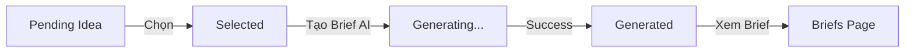

# 🌐 Frontend Pages Guide

## Tổng Quan

Ứng dụng Content Multiplier có 2 trang chính với navigation menu để chuyển đổi dễ dàng:

1. **Trang Ý Tưởng** (`/ideas`) - Quản lý và chọn ý tưởng
2. **Trang Briefs** (`/briefs`) - Xem các bản kế hoạch nội dung đã tạo

---

## 🎨 Layout & Navigation

### Sidebar Menu

Menu navigation ở sidebar bên trái với các mục:
- 🏠 **Trang chủ** (`/`)
- 💡 **Ý tưởng** (`/ideas`)
- 📋 **Briefs** (`/briefs`)
- 📦 **Packs** (`/packs`)
- ⚙️ **Cài đặt** (`/settings`)

**Features**:
- ✅ Active state highlighting
- ✅ Collapsible sidebar (thu gọn)
- ✅ Theme toggle (Light/Dark mode)
- ✅ Responsive design
- ✅ Smooth transitions

---

## 💡 Trang Ý Tưởng (`/ideas`)

### URL
```
http://localhost:3910/ideas
```

### Tính Năng

#### 1. **Statistics Dashboard**
Hiển thị thống kê nhanh:
- Tổng số ý tưởng
- Số lượng theo status: Pending, Selected, Generated

#### 2. **Ideas List**
Grid hiển thị các ý tưởng với thông tin:
- ✅ Tiêu đề và mô tả
- ✅ Status badge (Pending, Selected, Rejected, Generated)
- ✅ Persona & Industry tags
- ✅ Ngày tạo

#### 3. **Actions theo Status**

**Pending Ideas**:
```
┌─────────────────────────┐
│  ⏳ Pending             │
│  [✓ Chọn ý tưởng này]  │
│  [🗑 Xóa]              │
└─────────────────────────┘
```

**Selected Ideas**:
```
┌─────────────────────────┐
│  ✅ Selected            │
│  [📄 Tạo Brief với AI] │
│  [🗑 Xóa]              │
└─────────────────────────┘
```

**Generated Ideas**:
```
┌─────────────────────────┐
│  📄 Generated           │
│  [📋 Xem Brief]        │
│  [🗑 Xóa]              │
└─────────────────────────┘
```

#### 4. **Brief Generation Workflow**



**Steps**:
1. Click "Chọn ý tưởng này" → Status = `selected`
2. Click "Tạo Brief với AI" → Gọi API generate
3. Loading state với spinner
4. Thành công → Toast notification + Status = `generated`
5. Click "Xem Brief" → Navigate to `/briefs`

#### 5. **Error Handling**

**Validation Error (403)**:
```
❌ Không thể tạo brief
Idea phải có status "selected"
```

**API Error (500)**:
```
❌ Lỗi
Không thể tạo brief. [Chi tiết lỗi]
```

---

## 📋 Trang Briefs (`/briefs`)

### URL
```
http://localhost:3910/briefs
```

### Tính Năng

#### 1. **Statistics Dashboard**
Hiển thị thống kê:
- Tổng số briefs
- Số lượng theo status: Draft, Review, Published

#### 2. **Briefs List**
Vertical stack của brief cards với thông tin chi tiết:

```
┌──────────────────────────────────────────────────┐
│ Real-Time Vehicle Tracking: Build with MQTT     │
│ 📝 Draft        Từ ý tưởng: [Idea Title]       │
├──────────────────────────────────────────────────┤
│ 🎯 Đối tượng mục tiêu:                          │
│ This tutorial targets developers...              │
│                                                   │
│ 📋 Kế hoạch nội dung:                           │
│ The tutorial will begin with...                  │
│ [Xem thêm]                                       │
│                                                   │
│ 💡 Điểm chính:                                   │
│ [Tag 1] [Tag 2] [Tag 3] [Tag 4] [Tag 5] +3 more│
│                                                   │
│ Tone: Technical | Word Count: 2000 | Tạo: ...   │
│                                                   │
│ 🔑 Keywords:                                     │
│ [MQTT] [vehicle tracking] [IoT] [GPS tracking]  │
├──────────────────────────────────────────────────┤
│ [👁 Xem chi tiết] [✏️ Chỉnh sửa] [🗑 Xóa]      │
└──────────────────────────────────────────────────┘
```

#### 3. **Brief Card Components**

**Header**:
- Title + Status badge
- Link to source idea

**Content**:
- 🎯 Target Audience
- 📋 Content Plan (với expand/collapse)
- 💡 Key Points (top 5 + counter)
- Metadata: Tone, Word Count, Created Date
- 🔑 Keywords

**Footer Actions**:
- **Xem chi tiết** → `/briefs/[id]`
- **Chỉnh sửa** → Edit mode (coming soon)
- **Xóa** → Delete confirmation

#### 4. **Expand/Collapse**

Content Plan dài > 200 chars sẽ được truncate:
```typescript
<p className="line-clamp-3">
  {brief.content_plan}
</p>
<Button onClick={() => toggleExpand(id)}>
  {expanded ? 'Thu gọn' : 'Xem thêm'}
</Button>
```

#### 5. **Status Badges**

| Status | Badge | Color |
|--------|-------|-------|
| `draft` | 📝 Draft | Gray |
| `review` | 👀 Review | Orange |
| `approved` | ✓ Approved | Blue |
| `published` | 🚀 Published | Green |

---

## 🎯 User Flows

### Flow 1: Tạo Brief từ Idea

```
1. Vào /ideas
   ↓
2. Tìm idea với status "Pending"
   ↓
3. Click [✓ Chọn ý tưởng này]
   → Status = Selected
   ↓
4. Click [📄 Tạo Brief với AI]
   → API call /briefs/generate
   → Loading spinner (10-30s)
   ↓
5. Success!
   → Toast: "✨ Brief đã được tạo!"
   → Status = Generated
   ↓
6. Click [📋 Xem Brief]
   → Navigate to /briefs
   ↓
7. Xem brief mới trong danh sách
```

### Flow 2: Quản lý Briefs

```
1. Vào /briefs
   ↓
2. Xem danh sách briefs
   ↓
3. Options:
   a) [👁 Xem chi tiết] → /briefs/[id]
   b) [✏️ Chỉnh sửa]    → Edit form
   c) [🗑 Xóa]          → Confirm delete
```

---

## 🔄 State Management

### Ideas Page States

```typescript
const [ideas, setIdeas] = useState<Idea[]>([])
const [loading, setLoading] = useState(true)
const [deleteId, setDeleteId] = useState<number | null>(null)
const [updatingStatus, setUpdatingStatus] = useState<number | null>(null)
const [generatingBrief, setGeneratingBrief] = useState<number | null>(null)
```

### Briefs Page States

```typescript
const [briefs, setBriefs] = useState<Brief[]>([])
const [loading, setLoading] = useState(true)
const [deleteId, setDeleteId] = useState<number | null>(null)
const [expandedId, setExpandedId] = useState<number | null>(null)
```

---

## 🎨 UI Components Used

### From `components/ui/`

- ✅ `Button` - Các action buttons
- ✅ `Card`, `CardHeader`, `CardContent`, `CardFooter` - Brief/Idea cards
- ✅ `Badge` - Status, tags
- ✅ `EmptyState` - Khi chưa có data
- ✅ `SkeletonList` - Loading state
- ✅ `DeleteDialog` - Xác nhận xóa
- ✅ `PageTransition` - Smooth page transitions

### Custom Components

- ✅ `AppLayout` - Layout với sidebar
- ✅ `ThemeProvider` - Dark/Light mode

---

## 🚀 API Integration

### Ideas Page APIs

```typescript
// Get all ideas
GET /api/ideas
→ Idea[]

// Update idea status
PATCH /api/ideas/:id/status
Body: { status: 'selected' }
→ { success, idea }

// Generate brief
POST /api/briefs/generate
Body: { idea_id, model, temperature }
→ { success, brief }

// Delete idea
DELETE /api/ideas/:id
→ 204 No Content
```

### Briefs Page APIs

```typescript
// Get all briefs
GET /api/briefs
→ Brief[]

// Delete brief
DELETE /api/briefs/:id
→ 204 No Content
```

---

## 💅 Styling & Theming

### Theme Support

Cả 2 trang support Dark/Light mode:
- Light mode: `bg-background`, `text-foreground`
- Dark mode: Automatic với `ThemeProvider`

### Responsive Design

```css
/* Mobile: 1 column */
grid-cols-1

/* Tablet: 2 columns */
md:grid-cols-2

/* Desktop: 3 columns */
lg:grid-cols-3
```

### Hover Effects

```typescript
className="hover:shadow-lg transition-shadow duration-200"
```

---

## 🎭 Animations

### Page Transitions

```typescript
<PageTransition>
  <div>...</div>
</PageTransition>
```

### Loading States

```typescript
{loading ? (
  <SkeletonList count={6} type="ideas" />
) : (
  <div>Content</div>
)}
```

### Button States

```typescript
{isLoading ? (
  <>
    <Loader2 className="animate-spin" />
    Đang xử lý...
  </>
) : (
  <>
    <Icon />
    Label
  </>
)}
```

---

## 🐛 Troubleshooting

### Empty State Issues

**Problem**: Ideas page trống
**Solution**: 
- Kiểm tra backend có chạy: `curl http://localhost:3911/api/ideas`
- Tạo ideas mới từ trang chủ (`/`)

**Problem**: Briefs page trống
**Solution**:
- Vào `/ideas`
- Chọn một idea → Generate brief

### API Connection Errors

**Problem**: `Error fetching ideas`
**Check**:
```bash
# Backend health
curl http://localhost:3911/health

# Ideas API
curl http://localhost:3911/api/ideas

# Briefs API
curl http://localhost:3911/api/briefs
```

### Brief Generation Fails

**Problem**: 403 Forbidden
**Cause**: Idea status không phải `selected`
**Solution**: Click "Chọn ý tưởng này" trước

**Problem**: 500 Internal Server Error
**Possible causes**:
- API key invalid/expired
- Rate limit exceeded
- AI service down

---

## 📱 Mobile Experience

### Navigation

- Sidebar có thể collapse
- Touch-friendly button sizes
- Responsive grid layout

### Cards

- Full-width on mobile
- 2 columns on tablet
- 3 columns on desktop

---

## 🎯 Best Practices

### Performance

1. **Lazy Loading**: Chỉ load data khi cần
2. **Skeleton Screens**: Hiển thị loading state đẹp
3. **Optimistic Updates**: UI update ngay, API call sau
4. **Error Boundaries**: Graceful error handling

### UX

1. **Clear Status**: Badge colors rõ ràng
2. **Loading Feedback**: Spinner + disable buttons
3. **Confirmation**: Dialog trước khi xóa
4. **Toast Notifications**: Success/Error messages
5. **Empty States**: Hướng dẫn user làm gì tiếp theo

### Accessibility

1. **Semantic HTML**: Proper heading hierarchy
2. **Alt Text**: Icons có labels
3. **Keyboard Navigation**: Tab qua các elements
4. **Color Contrast**: Đảm bảo readable

---

## 🔜 Future Enhancements

### Ideas Page
- [ ] Bulk select ideas
- [ ] Filter by status
- [ ] Search functionality
- [ ] Sort options
- [ ] Edit idea inline

### Briefs Page
- [ ] Filter by status
- [ ] Search briefs
- [ ] Export to PDF/Markdown
- [ ] Collaborative editing
- [ ] Version history
- [ ] Comments/feedback

---

## 📚 Related Documentation

- [Brief Generation Guide](./BRIEF_GENERATION_GUIDE.md)
- [Status Validation Guide](./STATUS_VALIDATION_GUIDE.md)
- [Implementation Summary](./IMPLEMENTATION_SUMMARY.md)
- [README](./README.md)

---

**Created**: November 3, 2025  
**Status**: ✅ Production Ready  
**Pages**: 2 main pages + Navigation  
**Framework**: Next.js 14 + Tailwind CSS

